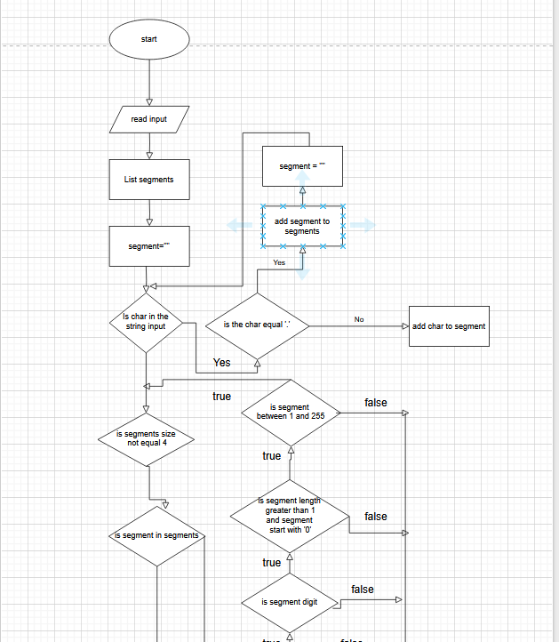
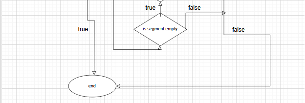

# IPv4 Address Validator (Kotlin)

*Validates IPv4 addresses according to RFC 791 standards*

A Kotlin implementation that checks if a string is a valid IPv4 address with proper formatting and range validation.

## Features

✅ **Structural Validation**  
   - Exactly 4 segments separated by dots  
   - No empty segments  
   - No leading zeros (except single zero)

✅ **Content Validation**  
   - Only numeric digits (0-9)  
   - Each segment between 0-255  

✅ **Efficient Checking**  
   - Early termination on invalid formats  
   - Per-segment validation pipeline

   
   